 

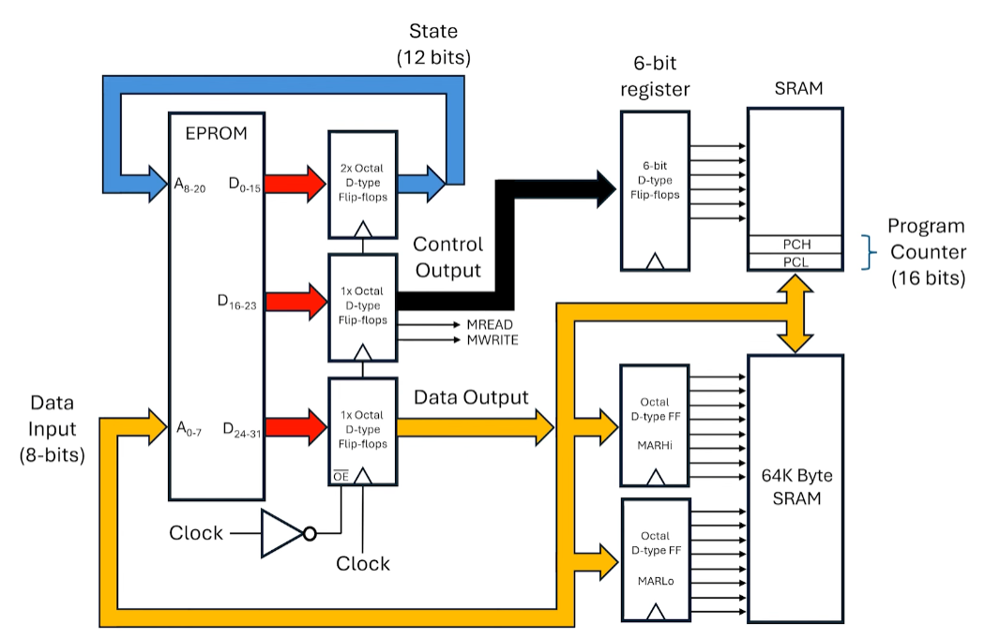

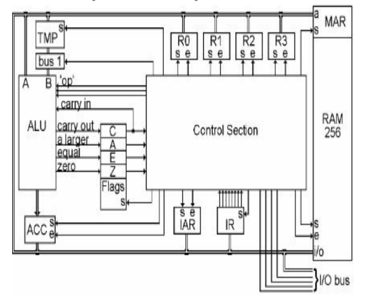

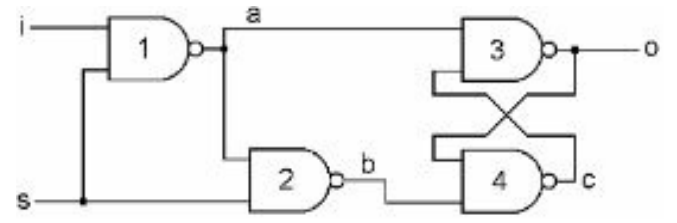

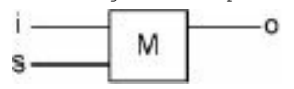

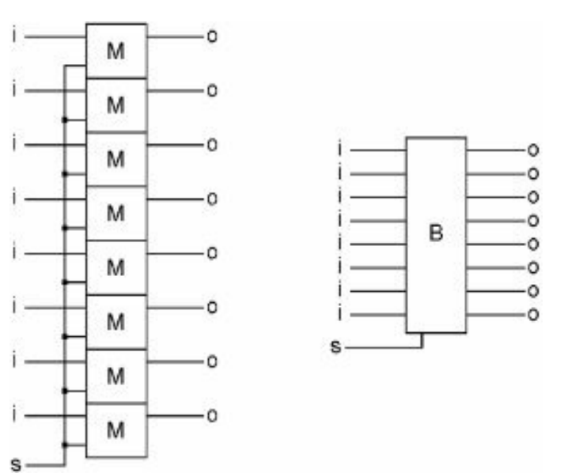

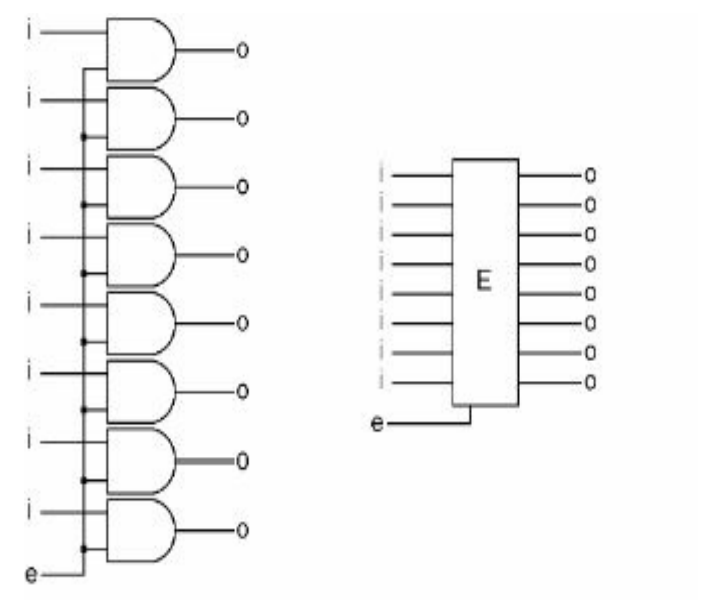

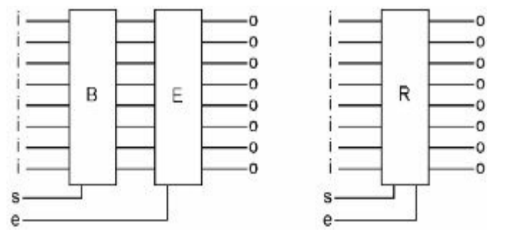

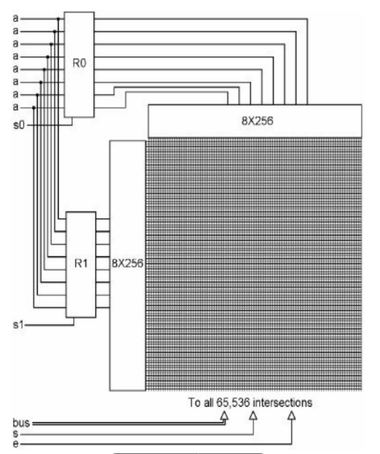

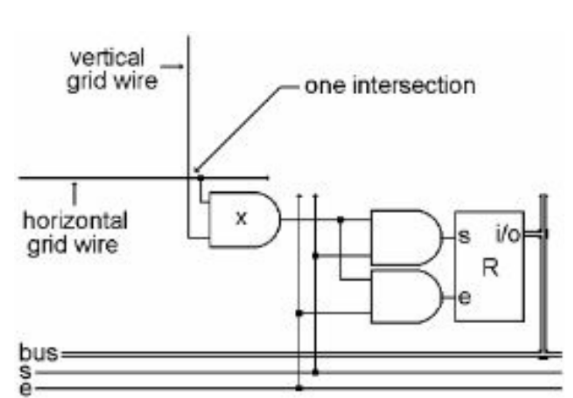

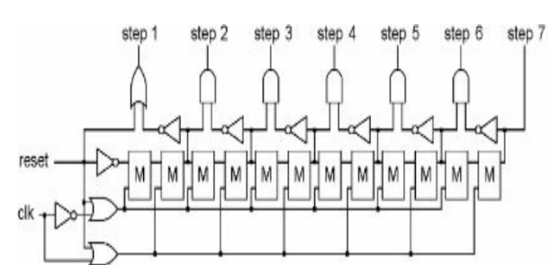

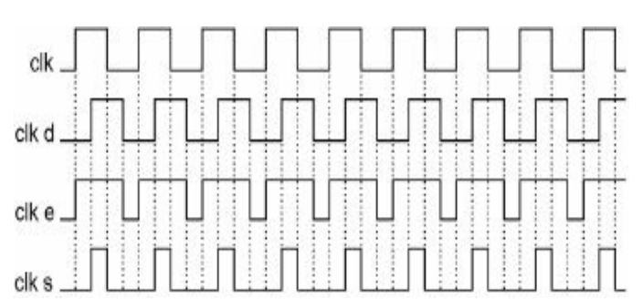

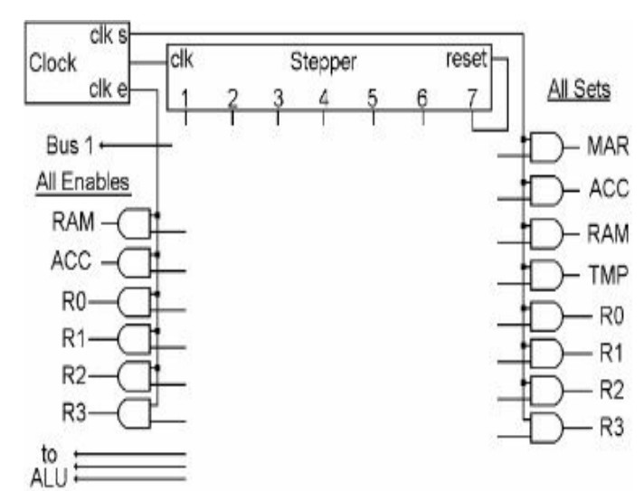

## What happens when you boot your computer?

The term boot is a shortened version of the term bootstrap, which is itself a reference to the
seemingly impossible task a computer must perform on **start-up**, namely, “pulling itself up by its
own bootstraps.”

The solution to this dilemma is that the microprocessor, in its power-on default state, is
hard-wired to fetch that first instruction from a predetermined address in memory. This first
instruction, which is loaded into the processor’s instruction register, is the first line of a
program called the **BIOS** (Basic Input/Output System) that lives in a special set of storage
locations—a small read-only memory **(ROM) module attached to the computer’s motherboard**. It’s the
job of the BIOS to perform basic tests of the RAM and peripherals in order to verify that everything
is working properly. Then the boot process can continue.

At the end of the BIOS program lies a jump instruction, the target of which is the location of a
**bootloader program**. By using a jump, the BIOS hands off control of the system to this second
program, whose job it is to search for and load the computer’s operating system from the hard disk.
The operating system (OS) loads and unloads all of the other programs that run on the computer, so
once the OS is up and running the computer is ready to interact with the user.

## Reprezentacja liczb

* Przedstaw sposób kodowania liczb w systemie U2.

  Wartość dziesiętną liczby U2 wyraża wzór:

  $$-a_{n-1} \times 2^{n-1} + \sum_{i=0}^{n-2} a_i \times 2^i$$
  
  Aby zamienić liczbę w U2 na przeciwną, należy wykonać dwa kroki: dokonać inwersji bitów, czyli
  zamienić 0 na 1 i odwrotnie i zwiększyć wynik o 1. Zaletą tego kodu jest również istnienie tylko
  jednego zera. Przedział kodowanych liczb nie jest przez to symetryczny. Dla reprezentacji
  8-bitowej są to liczby od −128 do 127. Liczba -2n-1 nie ma liczby przeciwnej w reprezentacji U2.

* Reprezentacja zmiennoprzecinkowa (float)  
  
  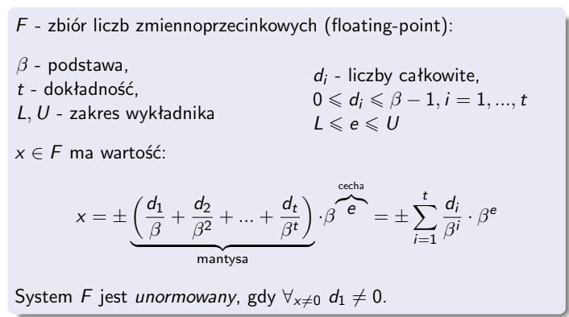

## The Basics of Application Memory Management

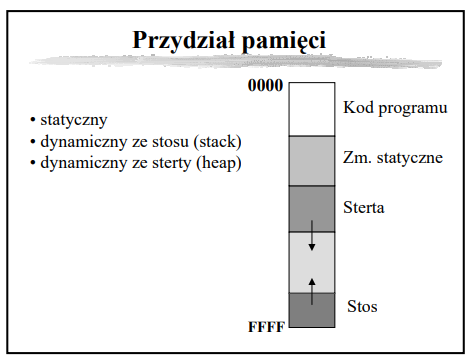

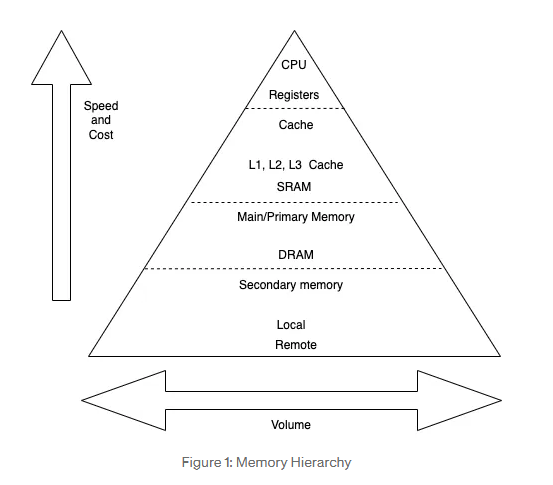

* Podaj sposoby przydziału pamięci dla zmiennych. 

  Statyczny (static allocation) – pamięć dla zmiennych jest przydzielana w czasie kompilacji i
  pozostaje zarezerwowana przez cały czas działania programu. Zmienna ma stały rozmiar i adres w
  pamięci. Np. zmienne globalne, statyczne
  
  Dynamiczny ze stosu (stack allocation) – pamięć jest zarezerwowana dopóki zmienna nie wyjdzie poza
  scope. Typowo dla zmiennych lokalnych. Stos ma ograniczony rozmiar (typowo od 1 do kilku MB).
  
  Dynamiczny ze sterty (heap allocation) – pamięć jest rezerwowana i zwalniana dynamicznie na
  żądanie np. przy użyciu funkcji malloc() i free(). Używana do alokacji dużych zmiennych (tablic,
  struktur, itp.)

* Opisz zasady przydziału pamięci dla zmiennych strukturalnych w języku C. Dlaczego się je stosuje?
  
  Kolejność pól w pamięci jest zgodna z kolejnością deklaracji w kodzie źródłowym. Dodatkowo stosuje
  się wyrównania (padding) aby zoptymalizować dostęp do pamięci (np. wyrównanie do 4/8 bajtów).

* Sposoby przekazywania parametrów do procedur i funkcji.

  Przekazywanie przez wartość (by value) – do funkcji lub procedury przekazywana jest kopia wartości
  argumentu. Oryginalna zmienna pozostaje nienaruszona, nawet jeśli wewnątrz funkcji zmienimy
  wartość parametru.
  
  Przekazywanie przez referencję (by reference) – do funkcji przekazywane jest odniesienie
  (referencja) do oryginalnej zmiennej. Zmiany dokonane wewnątrz funkcji wpływają na oryginalną
  zmienną.
  
  Przekazywanie przez wskaźnik (by pointer) – do funkcji przekazywany jest wskaźnik na zmienną, co
  umożliwia modyfikację danych w pamięci, do której wskaźnik się odnosi.

* W Javie wszystkie obiekty i tablice mieszczą się w obszarze pamięci nazywanym stertą (ang. heap) –
  jest jedna na proces, wspólna dla wszystkich jego wątków. Nie ma specjalnej struktury, jest
  nieuporządkowana (z punktu widzenia programu), stąd nazwa. Każdy wątek ponadto ma w pamięci swój
  stos (stack), gdzie mieszczą się informacje o obecnie trwających wywołaniach funkcji, w tym
  argumenty funkcji i zmienne lokalne.

  Wykonanie programu polega na wywołaniu (w wątku głównym) funkcji main; podczas tego wywołania
  możemy przejść do wywołania funkcji wewnątrz main, a w niej do kolejnej funkcji, i tak dalej. W
  danym momencie stos musi więc pamiętać sekwencję obecnie trwających, zagnieżdżonych wywołań
  funkcji – czyli wszystkie wywołania które zaczęliśmy, a z których jeszcze nie wyszliśmy. Stos
  składa się z sekwencji ramek stosu (stack frame) odpowiadających kolejnym wywołaniom: od main, aż
  po obecnie wykonywaną funkcję. Każdy inny wątek będzie miał własny stos, tylko zaczynający się od
  innej funkcji niż main.

  Na ramkę stosu składa się odnośnik do wykonywanej funkcji, oraz argumenty wywołania i zmienne
  lokalne. Ale, co ważne, prymitywne zmienne (int/float/boolean/char/short/long/double/byte) są
  zapisane w ramce stosu bezpośrednio, przez wartość, natomiast dla obiektów i tablic zapisujemy w
  ramce stosu tylko referencję (wskaźnik 32 lub 64-bitowy) do pozycji obiektu/tablicy na wspólnej
  stercie.

  Zmiennych na stosie nie da się sięgnąć z innego wątku, więc ich zachowanie jest proste i
  bezpieczne.

  W językach C, C++, Rust Krótko mówiąc jest tak samo, ale rozróżniamy w kodzie obiekt od wskaźnika
  na obiekt; zmienne lokalne zawsze są na stosie – sami decydujemy czy trzymamy obiekt bezpośrednio
  na stosie, czy trzymamy na stosie tylko wskaźnik do obiektu utworzonego na stercie.

* For many architectures, allocating memory on the stack is just a matter of changing the stack
  pointer, i.e. it's one instruction. Allocating memory on the heap involves looking for a big
  enough block, splitting it, and managing the "book-keeping" that allows things like free() in a
  different order.

* The executing program is stored in the primary memory, which is also known as the main memory.
  More specifically though, all variables, functions, parameters and the like are stored in stack or
  heap memory which is allocated in RAM segments within the primary memory.

* Stack memory is a region of memory that is allocated on contiguous blocks within RAM for a
  process. Furthermore it acts as a LIFO (last-in-first-out) buffer for data or instructions. So
  basically, if a variable is the last element in the stack, it will be the first to be removed when
  it is time for memory to be deallocated. Examples of data that are stored within the stack are:
  local variables, functions and pointer variables. The capacity of the stack remains static while
  the program executes and is usuallly few MBs.

* Heap memory, like stack memory, is allocated within RAM. It is used for dynamic memory allocation
  and can be likened to a free pool. Complex data is stored here, such as: global variables,
  reference types, strings and maps.

* **Garbage collection** to jedna z metod automatycznego zarządzania dynamicznie przydzielaną
  pamięcią, w której za proces jej zwalniania odpowiedzialny jest nie programista, lecz programowy
  zarządca noszący nazwę garbage collector
  
  - **Zliczanie referencji (ang. reference counting)** jest jedną z najprostszych metod odśmiecania.
    W metodzie tej alokowane obiekty posiadają dodatkowe pole, które wykorzystywane jest do
    zliczania odwołań do danego obiektu, co pozwala stwierdzić czy jest on jeszcze wykorzystywany.
    Podczas alokowania obiektu pole to ustawiane jest na 1, następnie za każdym razem, gdy do
    obiektu dodawane jest odwołanie, licznik ten jest zwiększany o jeden, a gdy odwołanie jest
    usuwane – licznik jest zmniejszany o jeden. Wyzerowanie licznika oznacza, że w programie nie
    istnieje żadne odwołanie do tego obiektu – nie jest on używany oraz nie ma możliwości ponownego,
    poprawnego odwołania się do niego, w związku z czym przydzielona mu pamięć może zostać zwolniona
  
    Metoda ta nie gwarantuje zwolnienia wszystkich niepotrzebnych obszarów w sytuacji, gdy występują
    tzw. wzajemne (cykliczne) odwołania.

## UNIX

System operacyjny - program, która działa jako pośrednik między użytkownikiem a sprzętem
komputerowym. Jest zarządcą zasobów: (bierne) procesor, pamięć operacyjna / masowa oraz procesów.

* Użytkownicy w systemie UNIX:
  - nazwa użytkownika jest **niepowtarzalna**
  - ich liczba jest ograniczona do 2^16

* Architektura systemu
  - **sprzęt (hardware)** - znajduje się w środku systemu komputerowego; dostarcza zasobów biernych
  - **jądro systemu (kernel)** - ma bezpośredni dostęp do sprzętu
  - **programy systemowe**
  - **programy użytkowe** - programy użytkowe mogą korzystać z programów i komend systemowych
  
  Rolą systemu jest wspieranie iluzji:
  - istnienia systemu plików dysponującego "miejscem" do przechowywania informacji
  - istnienia przestrzeni, w której wykonują się procesy użytkowników

  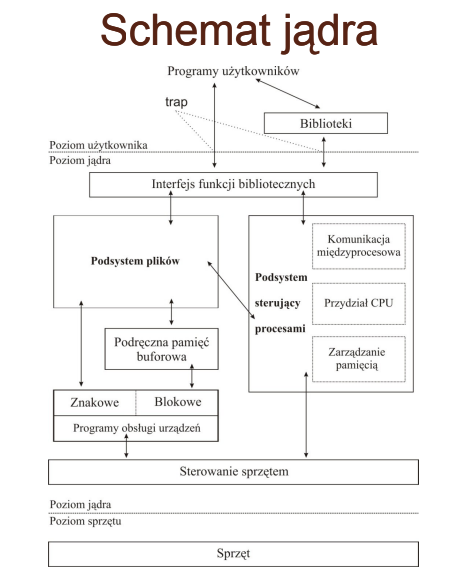

* Podsystem sterujący procesami jest odpowiedzialny za:
  
  - Szeregowanie procesów – realizuje politykę przydzielania CPU procesom. Ustala on kolejność
    wykonania procesów oraz przydziela im procesor do chwili zakończenia wykonywania lub wyczerpania
    kwantu czasu.
  
  - Zarządzanie pamięcią operacyjną – przydzielanie pamięci dla procesów. Jeśli w danym momencie
    czasu nie ma dość pamięci fizycznej dla wszystkich procesów, to w zależności od stopnia deficytu
    jądro przesyła ich fragmenty lub całe procesy między obszarem wymiany tak, aby każdy z nich miał
    szansę się wykonać.
  
  - Realizacja mechanizmów komunikacji międzyprocesowej – dostępne mechanizmy umożliwiają
    asynchroniczne sygnalizowanie pewnych zdarzeń oraz synchroniczną transmisję komunikatów między
    procesami.

* Podsystem plików:
  - Zarządza plikami, przydzielając im miejsce, administruje dostępnym miejscem w systemach plików,
    steruje dostępem do plików i udostępnia dane użytkownikom.

* Zadaniem funkcji bibliotecznych jest odwzorowanie wywołań funkcji w programach na wywołania
  funkcji systemowych, umożliwiających dostęp do jądra systemu.

  Funkcje biblioteczne są łączone z kodem programu użytkownika po jego kompilacji, na etapie
  linkowania.

* **Proces** to wykonujący się program. Wykonaniem procesów steruje jądro stwarzając wrażenie, że
  wiele procesów wykonuje się jednocześnie. Proces wykonuje się przechodząc przez ściśle ustalony
  ciąg instrukcji stanowiący całość i nigdy nie wykonuje skoków do instrukcji innego procesu.
  
  - Proces to jednostka utworzona za pomocą funkcji `fork()`, za wyjątkiem procesu o numerze 0
  - Proces wywołujący forka nazywa się macierzystym, a nowo utworzony - potomnym
  - Kernel identyfikuje proces za pomocą identyfikatora PID
  - Proces o PID=0 jest tworzony podczas **inicjalizacji systemu**. Tworzy on proces o PID=1 (tzw.
    init), który jest przodkiem kolejnych procesów.
  - Proces może pracować w trybie użytkownika lub w trybie jądra.

* **Wątek (thread)** jest fragmentem wykonującego się programu w obrębie danego procesu. Każdy wątek
  posiada osobny licznik rozkazów, ale korzysta z segmentu kodu procesu. Posiada własny stos,
  natomiast współdzieli przestrzeń adresową z innymi wątkami w danym procesie.

* **Sygnał** jest informacją wysyłaną **asynchronicznie**, która steruje procesem. Do wysyłania
  sygnałów służy polecenie `kill`
  - 15 TERM - graceful zakończnienie wykonywania procesu
  - 9 KILL - forceful zakończenie wykonywania procesu
  - 3 QUIT - ^C
  - 20 TerminalSToP - ^Z

* **i-node** to podstawowa struktura opisująca plik. Każdy plik jest opisywany przez jeden i-węzeł
  niezależnie od tego pod iloma nazwami plik ten występuje. i-węzeł zawiera informacje takie jak:
  typ pliku, identyfikator właściciela, prawa dostępu, tablicę alokacji pliku na dysku.

## Sieci

* **Model ISO/OSI**

  Podstawowyt model warstwowy, unifikujący rozwiązania sieciowe. Idea polega na określeniu zadań
  poszczególnych warstw oraz standaryzacji interfejsów między warstwami, co ułatwia tworzenie
  aplikacji sieciowych.

  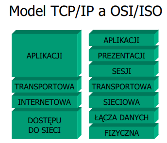

* **Warstwa dostępu do sieci**

  Tu odbywa się właściwa komunikacja na poziomie pojedynczych bitów. W warstwie tej zdefiniowane są
  parametry fizyczne transmisji takie jak właściwości medium transmisyjnego, poziomy oraz czasy
  trwania sygnałów, itd. W tej warstwie zdefiniowany jest adres sprzętowy (MAC - Media Access
  Control), który jest przypisany do interfejsu (NIC - Network Interface Card):

  - 48 bitów, zapisywanych jako kolejne bajty w systemie szesnastkowym oddzielone ":" (np.
    00:0A:E6:3E:FD:E1)
  
  - Powinien być unikatowy w skali świata.
  
  - Producenci interfejsów dzielą pulę adresową między siebie.

  Protokołami tej warstwy są np. Ethernet.

* **Warstwa sieciowa** - w niej zdefiniowane są protokoły umożliwiające dostęp do Internetu i
  znalezienie najlepszej drogi łączącej dwa hosty , które mogą się znajdować w oddzielnych z punktu
  widzenia warstwy łącza danych sieciach.

  - Protokół IP (Internet Protocol) – zapewniający ciągłą, hierarchiczną adresację hostów oraz
    obsługę zaadresowanych ramek

  - Protokół ARP (Address Resolution Protocol) pozwalający na znalezienie adresu MAC w oparciu o
    adres IP w celu fizycznego przesłania informacji.

  **Protokół IPv4**

  Adres ma postać 4 bajtów zapisywanych dziesiątkowo oddzielonych kropkami, czyli 32 bitów. Adres
  składa się z części adresującej sieć i części adresującej hosta. Gdzie przebiega granica? Wstępny
  podział na klasy adresowe zakładał granice występujące na kropkach. 

  Wyczerpywanie się puli adresowej IP v IV spowodowało konieczność poszukiwania bardziej oszczędnych
  mechanizmów gospodarowania nimi. Stąd: 
  
  - Network Address Translation (NAT)
  
  - routing bezklasowy – wymagający podania maski podsieci wskazującej na granicę w adresie między
    częścią adresującą sieć i częścią adresującą hosta.

    Np. 147.132.90.72/26 (26 bitów maski)
    
    10010011.10000100.01011010.01001000 adres
    
    11111111.11111111.11111111.11000000 maska
    
    10010011.10000100.01011010.01000000 adres sieci (147.132.90.64)

    10010011.10000100.01011010.01111111 adres broadcastowy (147.132.90.127)
  
  **Protokół DHCP**

  Protokół DHCP (Dynamic Host Configuration Protocol) służy do dynamicznego nadawania adresów IP
  hostom w danej sieci. Wymaga istnienia co najmniej jednego serwera DHCP w sieci lokalnej. Każdy
  serwer musi posiadać zdefiniowaną pulę adresów IP „do rozdania”. W przypadku kilku serwerów w
  jednej sieci ich pule muszą być rozłączne. Uzyskanie adresu IP składa się z 4 faz:

  - DHCPDISCOVER – klient do wszystkich serwerów DHCP w sieci (co 2, 4, 8, 16 sec. 5 min) wysyła
    zapytanie.

  - DHCPOFFER wszystkie serwery DHCP wysyłają do klienta od którego otrzymały zapytanie z propozycją
    adresu.
  
  - DHCPREQUEST – klient do wybranego serwera DHCP z informacją o wybraniu adresu.

  - DHCPACK – serwer DHCP do klienta, któremu wydzierżawia adres ze swojej puli.

  Po upływie połowy czasu dzierżawy klient występuje o przedłużenie czasu dzierżawy.

* **Warstwa transportowa** 

  Odpowiada za segmentację danych z warstw wyŜszych i ponowne ich złoŜenie w punkcie docelowym. MoŜe
  zapewniać niezawodność przesyłania danych i parametry jakości transmisji (QoS). Zawiera dwa
  protokoły:

  - TCP (Transmission Control Protocol) - protokół połączeniowy, niezawodny. Przed przesłaniem
    pakietu zestawiany jest obwód wirtualny (protokół point-to-point) za pomocą procedury 3-way
    handshake. Przesłanie pakietu wymaga potwierdzenia – jego brak implikuje kolejne próby
    przesłania. Posiada kontrole przepływu danych.
  
  - UDP (User Datagram Protocol) – protokół bezpołączeniowy. Przesyłane są datagramy, bez
    potwierdzenia i ew. retransmisji. Jest szybki, ale zawodny w szczególności: nie zawiera żadnych
    komunikatów potwierdzających przyjęcie pakietu bądź informujących o jego zagubieniu, nie
    gwarantuje, że dane zostaną dostarczone do procesu docelowego w kolejności wys łania, pakiety
    danych mogą być zduplikowane, nie zawiera żadnego mechanizmu kontroli prędkości przesy łania
    danych pomiędzy hostami.

  W sieci wykorzystywany jest model klient- serwer.
  - Stroną czynną jest klient, który żąda od serwera udostępniania usług. 
  - Żądanie wysyłane do klienta jest parą adresu IP oraz numeru usługi - portu. 
  - Usługi posiadają zdefiniowane numery. 
  - Serwer, aby rozpoznać połączenia z tego samego klienta nadaje im numer (port efemeryczny) z
    przedziału 49152 do 65535.

* **DNS** (Domain Name System) - rozproszona baza danych używana w sieciach TCP/IP do tłumaczenia
  nazw komputerów na adresy IP. Przestrzeń nazw domeny jest schematem nazewniczym udostępniającym
  hierarchiczną strukturę dla bazy danych DNS.

  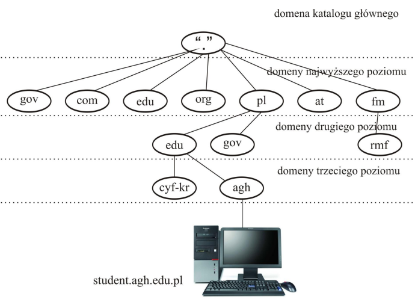

* **HTTP(S)** (Hypertext Transfer Protocol) - protokół warstwy aplikacji umożliwiający przesyłanie
  zróżnicowanych rodzajów danych/zasobów (ang. resources) przez internet np. strony HTML (HyperText
  Markup Language), aplikacje, pliki graficzne. Cechy:

  - Protokół klient-serwer: serwer to jakiś serwer WWW, natomiast klientem jest typowo przeglądarka
    internetowa
  - Protokół bezstanowy i bezpołączeniowy – działa w oparciu o model żądanie/odpowiedź – po
    dostarczeniu danych połączenie najczęściej jest zamykane
  - Możliwe wykorzystanie innego niż TCP, ale niezawodnego protokołu transportowego 
  - Rodzaje żądań HTTP: GET, POST, PUT, DELETE, HEAD, inne

  **Ciasteczko (cookie)** to ciąg znaków przechowywany w pamięci przeglądarki. Ciasteczka to sposób
  na:
  - utrzymanie stanu sesji
  - zapewnienia personalizacji stron WWW
  - prowadzenie statystyk przez administratorów serwera Są przekazywane w nagłówku żądań HTTP.

  **HTTPS**:
    - Wykorzystuje SSL (Secure Socket Layer) / TLS (Transport Layer Security)
      - Otwarty standard opracowany przez Netscape
      - Rozwiązanie oparte na kryptografii z kluczem publicznym – klucz o długości 128 bit (dziś
        sugerowana 2048 bit)
      - szyfrowanie danych na czas transmisji kluczem sesji
      - uwierzytelnianie klienta i serwera
    - Domyślnie używa portu 443 TCP
    
