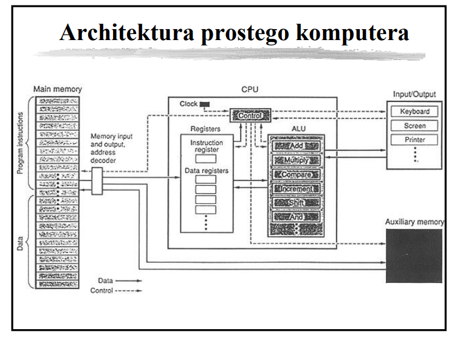

 

## What happens when you boot your computer?

The term boot is a shortened version of the term bootstrap, which is itself a reference to the
seemingly impossible task a computer must perform on **start-up**, namely, “pulling itself up by its
own bootstraps.”

The solution to this dilemma is that the microprocessor, in its power-on default state, is
hard-wired to fetch that first instruction from a predetermined address in memory. This first
instruction, which is loaded into the processor’s instruction register, is the first line of a
program called the **BIOS** (Basic Input/Output System) that lives in a special set of storage
locations—a small read-only memory **(ROM) module attached to the computer’s motherboard**. It’s the
job of the BIOS to perform basic tests of the RAM and peripherals in order to verify that everything
is working properly. Then the boot process can continue.

At the end of the BIOS program lies a jump instruction, the target of which is the location of a
**bootloader program**. By using a jump, the BIOS hands off control of the system to this second
program, whose job it is to search for and load the computer’s operating system from the hard disk.
The operating system (OS) loads and unloads all of the other programs that run on the computer, so
once the OS is up and running the computer is ready to interact with the user.

## Reprezentacja liczb

* Przedstaw sposób kodowania liczb w systemie U2.

  Wartość dziesiętną liczby U2 wyraża wzór:
  ```math
    -a_{n-1} \times 2^{n-1} + \sum_{i=0}^{n-2} a_i \times 2^i
  ```
  Aby zamienić liczbę w U2 na przeciwną, należy wykonać dwa kroki: dokonać inwersji bitów, czyli
  zamienić 0 na 1 i odwrotnie i zwiększyć wynik o 1. Zaletą tego kodu jest również istnienie tylko
  jednego zera. Przedział kodowanych liczb nie jest przez to symetryczny. Dla reprezentacji
  8-bitowej są to liczby od −128 do 127. Liczba -2n-1 nie ma liczby przeciwnej w reprezentacji U2.

  Zastosowania:
    - sprawy walutowe, operacje monetarne
    - procesory graficzne np. Sony, Nintendo
    - rozmiary czcionek w calach np. w TeX
    - libfixmath - implementacja biblioteki stałoprzecinkowej w C

* Reprezentacja zmiennoprzecinkowa (float)

  Należy pamiętać o ułomności reprezentacji zbioru liczb rzeczywistych $\mathbb{R}$ w rzeczywistym
  świecie skończonych komputerów.
  
  

  F nie jest kontinuum - więcej - jest skończony o liczbie elementów wyrażonych wzorem:
  ```math
    2 \cdot (\beta - 1) \cdot \beta^{t-1} \cdot (U - L + 1) + 1
  ```


## Hardware heap and stack


For many architectures, allocating memory on the stack is just a matter of changing the stack
pointer, i.e. it's one instruction. Allocating memory on the heap involves looking for a big enough
block, splitting it, and managing the "book-keeping" that allows things like free() in a different
order.

* Podaj sposoby przydziału pamięci dla zmiennych. 

  Statyczny (static allocation) – pamięć dla zmiennych jest przydzielana w czasie kompilacji i
  pozostaje zarezerwowana przez cały czas działania programu. Zmienna ma stały rozmiar i adres w
  pamięci. Np. zmienne globalne, statyczne
  
  Dynamiczny ze stosu (stack allocation) – pamięć jest zarezerwowana dopóki zmienna nie wyjdzie poza
  scope. Typowo dla zmiennych lokalnych. Stos ma ograniczony rozmiar (typowo od 1 do kilku MB).
  
  Dynamiczny ze sterty (heap allocation) – pamięć jest rezerwowana i zwalniana dynamicznie na
  żądanie np. przy użyciu funkcji malloc() i free(). Używana do alokacji dużych zmiennych (tablic,
  struktur, itp.)

* Opisz zasady przydziału pamięci dla zmiennych strukturalnych w języku C. Dlaczego się je stosuje?
  
  Kolejność pól w pamięci jest zgodna z kolejnością deklaracji w kodzie źródłowym. Dodatkowo stosuje
  się wyrównania (padding) aby zoptymalizować dostęp do pamięci (np. wyrównanie do 4/8 bajtów).


* Sposoby przekazywania parametrów do procedur i funkcji.

  Przekazywanie przez wartość (by value) – do funkcji lub procedury przekazywana jest kopia wartości
  argumentu. Oryginalna zmienna pozostaje nienaruszona, nawet jeśli wewnątrz funkcji zmienimy
  wartość parametru.
  
  Przekazywanie przez referencję (by reference) – do funkcji przekazywane jest odniesienie
  (referencja) do oryginalnej zmiennej. Zmiany dokonane wewnątrz funkcji wpływają na oryginalną
  zmienną.
  
  Przekazywanie przez wskaźnik (by pointer) – do funkcji przekazywany jest wskaźnik na zmienną, co
  umożliwia modyfikację danych w pamięci, do której wskaźnik się odnosi.


* W Javie wszystkie obiekty i tablice mieszczą się w obszarze pamięci nazywanym stertą (ang. heap) –
  jest jedna na proces, wspólna dla wszystkich jego wątków. Nie ma specjalnej struktury, jest
  nieuporządkowana (z punktu widzenia programu), stąd nazwa. Każdy wątek ponadto ma w pamięci swój
  stos (stack), gdzie mieszczą się informacje o obecnie trwających wywołaniach funkcji, w tym
  argumenty funkcji i zmienne lokalne.

  Wykonanie programu polega na wywołaniu (w wątku głównym) funkcji main; podczas tego wywołania
  możemy przejść do wywołania funkcji wewnątrz main, a w niej do kolejnej funkcji, i tak dalej. W
  danym momencie stos musi więc pamiętać sekwencję obecnie trwających, zagnieżdżonych wywołań
  funkcji – czyli wszystkie wywołania które zaczęliśmy, a z których jeszcze nie wyszliśmy. Stos
  składa się z sekwencji ramek stosu (stack frame) odpowiadających kolejnym wywołaniom: od main, aż
  po obecnie wykonywaną funkcję. Każdy inny wątek będzie miał własny stos, tylko zaczynający się od
  innej funkcji niż main.

  Na ramkę stosu składa się odnośnik do wykonywanej funkcji, oraz argumenty wywołania i zmienne
  lokalne. Ale, co ważne, prymitywne zmienne (int/float/boolean/char/short/long/double/byte) są
  zapisane w ramce stosu bezpośrednio, przez wartość, natomiast dla obiektów i tablic zapisujemy w
  ramce stosu tylko referencję (wskaźnik 32 lub 64-bitowy) do pozycji obiektu/tablicy na wspólnej
  stercie.

  Zmiennych na stosie nie da się sięgnąć z innego wątku, więc ich zachowanie jest proste i
  bezpieczne.

  W językach C, C++, Rust Krótko mówiąc jest tak samo, ale rozróżniamy w kodzie obiekt od wskaźnika
  na obiekt; zmienne lokalne zawsze są na stosie – sami decydujemy czy trzymamy obiekt bezpośrednio
  na stosie, czy trzymamy na stosie tylko wskaźnik do obiektu utworzonego na stercie.

## The Basics of Application Memory Management

The memory hierarchy categorises memory devices based on their response times (access time).


The executing program is stored in the primary memory, which is also known as the main memory. More
specifically though, all variables, functions, parameters and the like are stored in stack or heap
memory which is allocated in RAM segments within the primary memory.


### WHAT IS STACK & HEAP MEMORY?

Stack memory is a region of memory that is allocated on contiguous blocks within RAM for a process.
Furthermore it acts as a LIFO (last-in-first-out) buffer for data or instructions. So basically, if
a variable is the last element in the stack, it will be the first to be removed when it is time for
memory to be deallocated. Examples of data that are stored within the stack are: local variables,
functions and pointer variables. The capacity of the stack remains static while the program executes
and is usuallly few MBs.

Heap memory, like stack memory, is allocated within RAM. It is used for dynamic memory allocation
and can be likened to a free pool. Complex data is stored here, such as: global variables, reference
types, strings and maps.
