# Intro

Architektura - odnosi siędo tych własności systemy komputerowego, które są widzialne dla programisty

Organizacja - odnosi się do realizacji konkretnej architektury

## Architektura von Neumanna

- dane i rozkazy przechowywane są w tej samej pamięci umożliwiającej odczyt i zapis

- zawartość pamięci może być adresowana przez wskazanie miejsca, bez względu na rodzaj zawartych tam
  danych

- wykonywanie rozkazów następuje w sposób szeregowy, z wyjątkiem określonych szczególnych przypadków
  (skoki)


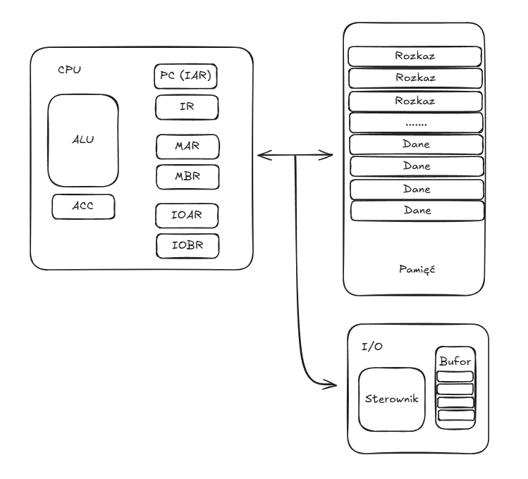

* MAR (Memory Address Register) - określa adres w pamięci następnego zapisu/odczytu
* MBR (Memory Buffer Register)  - zawiera dane, które mają być zapisane lub zostały odczytane
* PC (Program Counter) / IAR (Instruction Address Register) - służy do śledzenia adresu następnego
  pobranego rozkazu
* IR (Instruction Register) - przechowuje kod aktualnie wykonywanego rozkazu
* ACC (Accumulator) - przechowuje tymczasowo wyniki ALU

## Przerwania 

Przerwania to mechanizm, za pomocą którego inne moduły (pamięć, I/O) mogą przerwać normalne
przetwarzanie danych przez procesor

Klasy przerwań:

* *programowe* - generowane przez warunek będący wynikiem wykonywania rozkazu (np. dzielenie przez
  0, próba wykonania niedozwollonego rozkazu, próba dostępu do niedozwolonej pamięci)

* *zegarowe* - generwoane przez wewnętrzny zegar procesora; umożliwiają wykonanie pewnych funkcji
  przez system operacyjny

* *I/O* - generowane przez sterownik I/O

Gdy urządzenie I/O staje się gotowe do obsługi, moduł I/O zwiażany z tym urządzeniem wysyła **sygnał
żądania przerwania** do procesora. Procesor odpowiada, zawieszająć działanie bieżącego programu i
wykonuje skok do programu obsługującego to urządzenie zewnętrzne, nazywanego **programem obsługi
przerwań** (ang. interrupt handler). Po obsłużeniu przerwania następuje powrót do programu
bieżącego.

Program użytkowy nie musi zawierać jakiegoś specjalnego kodu w związku z przerwaniami; to procesor i
system operacyjny są odpowiedzialne za zawieszeznie programu użytkowego i powrót to tego samego
punktu po zakońćzeniu obsługi przerwania. Cykl rozkazowy jest więc uzupełniany o cykl przerwania

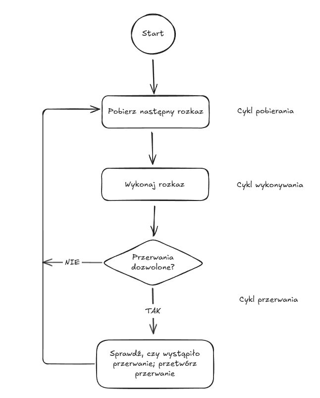

**Przerwania wielokrotne** to systuacja, w której przerwanie wywoływane przez sterownik następuje w
czasie, w którym przetwarzane jest przerwanie spowodowane przez inny sterownik. Możliwe sposoby
rozwiązania problemu przerwać wielokrotnych to:

* *przerwania zablokowane* (disabled interrupts) - procesor po prostu ignoruje inne przerwania
  podczas obsługi jednego z nich. Po zakończeniu przetwarzania przerwania, jeszcze przed wznowieniem
  programu użytkowego procesor sprawdza, czy wystąpiły dodatkowe przerwania.

* *przerwania priorytetowe* - pozwala się na to, że przerwanie o wyższym priorytecie powoduje
  przerwanie programu obsługi przerwania o niższym priorytecie


# Magistrala

Magistrala to droga zapwaniająca komunikacją między urządzeniami. System komputerowy zawiera pewną
liczbę różnych magistrali, które łączą zespoły komputera na różnych poziomach hierarchii. Magistrala
łąćząca główne zespoły komputera tj. procesor, pamięć i urządzenia I/O nazywa się **magistralą
systemową**.

Linie zawarte w magistrali można podzielić na trzy grupy funkcjonalne

* linie danych określane łącznie jako szyna danych (data bus)

* linie adresowe (address bus)

* linie sterowania (control bus)


# Pamięć wewnętrzna

Pamięć wewnętrzna jest często identyfikowana z pamięcią główną (ang. main memory). Są jednak również
inne formy pamięci wewnętrznej np. rejestry, czy pamięć sterująca ROM. Zasadniczo pamięć wewnętrzna
to dowolna pamięć, do której procesor może odnosić się bezpośrednio (tj. bez udziału innych
modułów). Pamięć zewnętrzna to pamięć dostępna dla CPU poprzez sterowniki I/O.

Sposoby dostępuu do jednostek danych:

* *dostęp sekwencyjny* - dostęp jest możliwy jedyni w określonej sekwencji liniowej

* *dostęp bezpośredni* - mamy bloki, które mają unikatowy adres przez co możemy mieć do nich
  bezpośredni dostęp, natomiast w obrębie bloku dostęp jest sekwencyjny

* *dostęp swobodny* - mamy bezpośredni dostęp do dowolnej adresowalnej jednostki danych

Miary wydajności pamięci:

* *czas dostępu* - czas od chwili doprowadzenia adresu do chwili zmagazynowania danych

* *czas cyklu pamięci* - czas dostępu + ewentualny czas, który musi upłynąć przez możliwością
  ponownego dostępu (np. czas wymagany do zaniku sygnałów przejściowych)

Pamięć **ulotna** to pamięć, w której informacja jest tracona po wyłączeniu zasilania. W pamięci
**nieulotnej** informacja raz zapisania nie zmienia się aż do chwili zamierzonej zmiany.

## Hierarchia pamięci


Kluczem do sukcesu przy projektowaniu organizacji pamięci jest *malejąca częstość dostępu do danego
poziomu hierarchi* idąc z góry na dół. Podstawą słuszności tego warunku jest *zasada lokalności
odniesień* (locality of reference)

* *Rejestry* - najszybszy, najmniejszy i najdroższy rodzaj pamięci, który znajduje się bezpośrednio
  wewnątrz procesora. Typowo CPU zawiera od kilkudziesięciu do kilkuset rejestrów.

* *Pamięć główna* - zasadniczy wewnętrzny system pamięciowy komputera. Jest to pamięć o dostępie
  swobodnym.

* *Pamięć podręczna* - pamięć główna jest zwykle poszerzana za pomocą szybszej i mniejszej pamięci
  podręcznej. Typowo pamięć podręczna nie jest widzialna dla programisty.

Wymienione wyżej rodzaje pamięci to pamięci ulotne wykonywane w technologii półprzewodnikowej.

* RAM = Random Access Memory (pamięć o dostępie swodobdnym)
* ROM = Read-Only Memory
* PROM = Programmable ROM
* EPROM = Erasable PROM (programowalna pamięć ROM wymazywalna za pomocą światła UV)
* EEPROM = Electrically Erasable PROM
* Flash = rodzaj pamięci PROM, będący rozszerzeniem EEPROM, typowo wykorzystywana dzisiaj do
  konstrukcji dysków SSD

Pamięci RAM można podzielić na *statyczne* (SRAM) i *dynamiczne* (DRAM).

DRAM jest wykonana z komórek, które przechowują dane podobnie jak kondensator przechowuje ładunek
elektryczny. Obecność lub brak ładunku w kondesatorze są interpretowane jako binarne 0 lub 1.
Ponieważ kondenastory mają naturalną tendencję do rozładowywania się, dynamiczne pamięci RAM
wymagają *okresowego odświeżania ładunku* w celu zachowania danych. Ich zaletą jest mniejsza liczba
tranzystorów wymaganych na 1 bit pamięci (dzięki wykorzystaniu kondensatorów), co umożliwia
uzyskanie większej gęstości danych. Są jednak trochę wolniejsze od pamięci SRAM. Typowo są stosowane
przy konstrukcji pamięci głównej RAM.

W przypadku SRAM wartości binarne są przechowywane za pomocą przerzutnikowych konfiguracji bramek
logicznych, dzięki czemu nie wymagają okresowego odświeżania. Są szybsze od pamięci dynamicznych,
ale wymagają więcej tranzystorów na 1 bit pamięci. Typowo stosowane są przy konstrukcji pamięci
podręcznych.

## Pamięć podręczna

Pamięć główna składa się z $2^n$ adresowalnych słów (dla adresu o szerokości $n$ bitów). Pamięć
podręczna jest znacznie mniejsza. Aby było możliwe odwzorowywanie pamięć główna jest dzielona na
pewną liczbę *bloków* o stałej długości zawierających $K$ słów każdy. W pamięci głównej występuje
więc $M = 2^n / K$ bloków.

Pamięć podręczna zawiera $C$ wierszy (ang. cache lines) zawierających po $K$ słów każdy, przy czym
$C \ll M$.

### Algorytmy odwzorowania (cache placement policy)

Algorytmy odwzorowania określają w jaki sposób blok pamięci głównej jest odwzorowywany na wiersz
pamięci podręcznej. Możliwe są następujące trzy podejścia

* *odwzorowanie bezpośrednie* - każdy blok w pamięci może być zapisany tylko w jednym ustalonym
  wierszu pamięci podręcznej

* *odwzorowanie skojarzeniowe* - blok pamięci może być zapisany pod dowolnym wierszem pamięci
  podręcznej

* *odwzorowanie sekcyjno-skojarzeniowe* - wiersze są podzielone na sekcje; każdy blok może być
  zapisany tylko w jednej ustalonej sekcji, ale w jej obrębie może być zapisany pod dowolnym
  wierszem

### Algorytmy zastępowania (cache replacement policy)

* LRU - Least Recently Used
* FIFO
* LFU - Least Frequently Used

### Spójność pamięci podręcznej (cache coherence)

Pojęcie spójności pamięci podręcznej odnosi się do sytuacji, w której mamy organizację magistralową
i więcej niż jedno urządzenie (typowo procesor) wyposażone w pamięć podręczną, podłączone do tej
magistrali.

Jeśli dane w pamięci podręcznej jednego z urządzeń są zmieniane, to operacja taka powoduje
*unieważnienie* odpowiednich danych nie tylko w pamięci głównej, ale także w innych pamięciach
podręcznych (jeśli dane słowo w nich akurat występuje).

### Pamięci podręczne jedno- i dwupoziomowe

W miarę wzrostu gęstości upakowania układów logicznych stało się możliwe dysponowanie *pamięcią
podręczną wewnątrz tego samego mikroukładu co procesor* (on-chip cache). W porównaniu z pamięcią
osiągalną za pomocą zewnętrznej magistrali wewnątrzprocesorowa pamięć podręczna zwiększa ogólną
wydajność systemu. Wbudowanie pamięci podręczne do procesora pozostawia pytanie, czy nadal pożądana
jest zewnętrzna (tj. poza mikroukładem procesora) pamięć podręczna. Odpowiedź zwykle jest pozytywna.
Wynikająca stąd organizacja hierarchiczna jest znana jako *dwupoziomowa organizacja pamięci
podręcznej*. Pamięć on-chip cache jest oznaczana jako poziom 1 (L1), a pamięć poza-układowa jako
poziom 2 (L2).


# Pamięć zewnętrzna

## Dysk magnetyczny

Dysk to okrągła płyta wykonana z metalu lub plastiku, pokryta materiałem magnetycznym. Dane są
zapisywane i odczytywane z dysku za pomocą przewodzącej cewki zwanej głowicą. Zapis polega na
wykorzystaniu pola magnetycznego wytwarzanego przez prąd elektryczny płynący przez cewkę. Przy
odczycie wykorzystuje się prąd elektryczny powstający w cecwece pod wpływem pola magnetycznego dysku
poruszającego się względem cewki.

## Pamięć RAID

Przy ograniczonej możliwości ulepszeania pojedynczych składników dodatkowy wzrost wydajności można
osiągnąć, wykorzystująć równolegle wiele składników. W przypadku pamięci dyskowych doprowadziło to
do opracowani *tablic dysków*, które pracują niezależnie i równolegle.

W przypadku używania wielu dysków istnieje wiele sposobów organizowania danych, co mogłoby utrudnić
opracowanie schematów baz danych. Dlatego uzgodniono znormalizowany schemat projektowania baz danych
dla pamięci wielodyskowych znany jako RAID = Redundant Array of Independent Disks.

1. RAID jest zespołem fizycznie istniejących napędów dyskowych widzianych przez system operacyjny
   jako pojedynczy napęd logiczny.

2. Dane są rozproszone w tych napędach tworzących tablicę.

3. Redundancyjna pojemność dysków jest wykorzystywana do przechowywania informacji o parzystości
   (kody korekcyjne), co gwarantuje odzyskanie danych w przypadku uszkodzeń dysku.


# Wejście-wyjście

Moduł (sterownik) wejścia-wyjścia:
* stanowi interfejs z procesorem i pamięcią
* stanowi interfejs z jednym lub wieloma urządzeniami peryferyjnymi

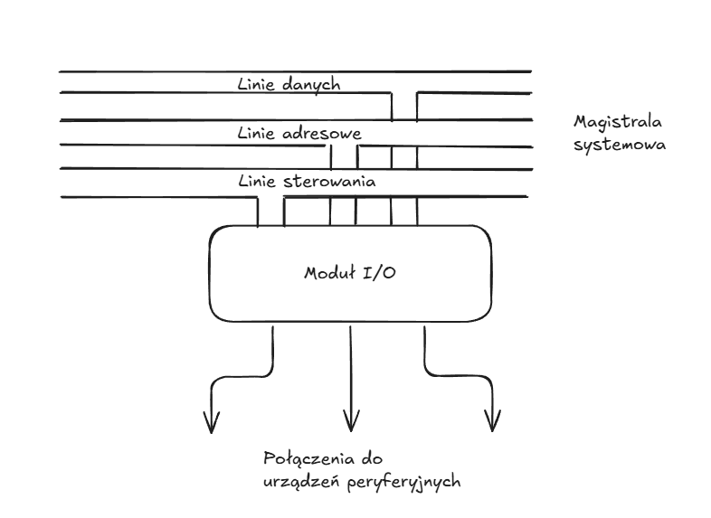

Istnieją trzy sposoby realizacji operacji wejścia-wyjścia:

* programowane wejście-wyjście
* wejście-wyjście sterowane przerwaniami
* bezpośredni dostęp do pamięci (DMA, Direct Memory Access)

## Przetwarzanie przerwań

1. Moduł sygnalizuje procesorowi przerwanie za pomocą odpowiedniej linii sterowania.
2. Procesor kończy wykonywanie bieżącego rozkazu i sprawdza, czy następiło przerwanie (cykl
   przerwań). Następnie jeśli jest przerwanie (na odpowiedniej linii) to wysyła to urządzenia sygnał
   ACK, co umożliwia temu urządzeniu usunięcie swojego sygnału przerwania.
3. Procesor musi teraz przygotować się do przeniesienia sterowania do programu obsługi przerwań.
   Najpierw musi zachować informację niezbędną do wznowienia bieżącego programu w punkcie jego
   przerwania:
   * stan procesora zawarty w rejstrze PSW (program status word), m.in. stan uprzywilejowania
     bieżącego programu
   * zawartość PC
   * zawartości innych rejestrów Typowo informacje te są umieszczane na stosie(TODO).
4. Następuje skok do programu obsługi przerwań.
5. Gdy przetwarzanie przerwania jest zakończone, zachowane wartości rejestrów są pobierane ze stosu
   w pamięci głównej i wprowadzane do rejestrów.
  
## Direct Memory Access (DMA)

DMA wymaga dodatkowego modułu na magistrali systemowej. Moduł DMA ,,udaje'' procesor i w
rzeczywistości przejmuje od procesora sterowanie systemem. Gdy procesor chce odczytania luv zapisu
bloku danych, wydaje odpowiedni rozkaz modułowi DAM. Procesor następnie kontynuuje inne prace. Moduł
DMA przenosi blok danych, słowo po słowie bezpośrednio z (lub do) pamięci. Gdy transfer jest
zakończony moduł DMA wysyła sygnał przerwania do procesora. W czas transferu moduł DMA wymaaga
przejęcia sterowania magistralą w celu przeniesienia danych. W tym celu wymusza czasowe zawieszenie
operacji procesora (tzw. *wykradanie cyklu*). Moduł DMA przesyła następnie jdno słowo i z wraca
sterowanie do procesora. Zauważmy, że procesr nie musi zachowywać kontekstu, ani wykonywać niczego
innego (jak w przypadku I/O sterowanego przerwaniami) - po prostu zatrzymuje się na jeden cykl
magistrali.

# Wspieranie systemu operacyjnego

Podział systemów operacyjnych:
* wsadowe (batch) - programy wielu użytkowników są łączone; powstaje wsad, który jest uruchamiany
  przez operatora komputera (w zasadzie tylko historyczne)
* konwersacyjne (interactive) - ma miejsce konwersacje między użytkownikiem, a komputerem zwykle za
  pośrednictwem terminala

Dodatkowo system operacyjny może być:
* jednoprogramowy
* wieloprogramowy

## Szeregowanie czasowe

Wieloprogramowanie polega na tym, że wiele zadań lub programów użytkowych pozostawia się w pamięci
głównej. Każde zadanie jest przełączene między używaniem procesora, a oczekiwaniem na realizację
operacji wejścia-wyjścia.

### Procesy

**proces** - realizowany program

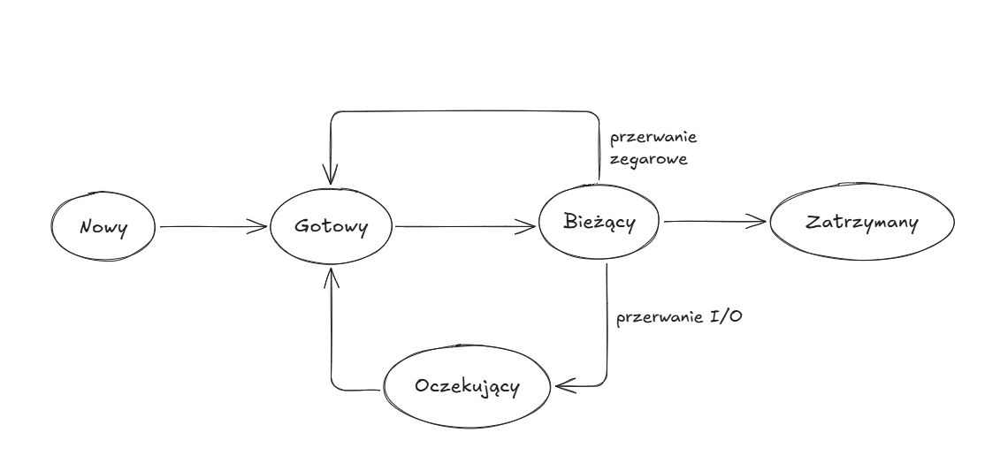

* ,,Nowy'' - program jest przyjęty przez program szeregujący lecz nie jest gotowy do realizacji.
  System operacyjny inicjuje proces, przesuwając go do stanu gotowości.
* ,,Gotowy'' - proces jest gotowy do wykonania i czeka na dostęp do procesora.
* ,,Bieżący'' - program jest realizowany przez procesor.
* ,,Oczekujący'' - realizacja procesu jest zawieszona.
* ,,Zatrzymany'' - proces został zakończony.

Każdy proces jest reprezentowany w systemie operacyjnym przez *blok kontrolny procesu* zawierający:
* identyfikator procesu
* stan procesu
* priorytet
* licznik programu
* znaczniki pamięci - początkowa i końcowa komórka zajmowane przez proces w pamięci
* dane dotyczące kontekstu

Gdy procesor akceptuje do wykonania nowe zadanie, tworzy czysty blok kontrolny procesu i umieszcza
związany z nim proces w staine ,,Nowy''. Po wypełnieniuprzez system bloku kontrolnego, proces jest
przenoszony do stanu ,,Gotowy''.

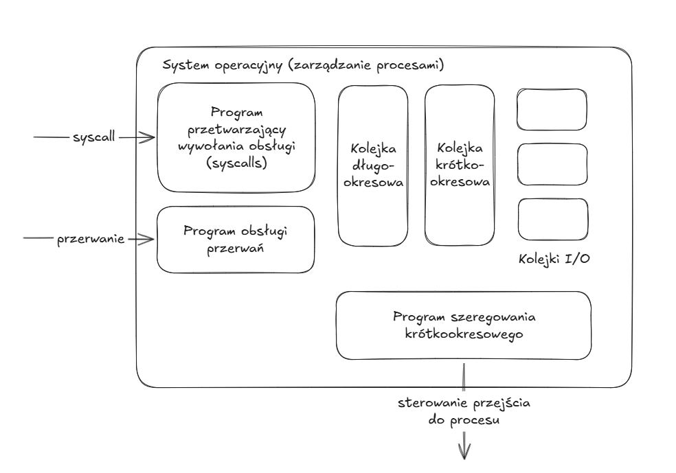


Oddanie sterowania do systemu operacyjnego następuje z jednego z trzech powodów
* proces przekazuje wywołanie obsługi systemowi operacyjnemu (tzw. syscall) np. żądanie I/O
* proces wywołuje przerwanie
* zdarzenie niewiązane z procesem powoduje przerwanie, np. przerwanie zegarowe

## Zarządzanie pamięcią

W systemie jednoprogramowym pamięć główna jest podzielona na dwie części:
* jedną przeznaczoną dla systemu operacyjnego (tzw. rezydentnego programu zarządzającego)
* drugą dla programu aktualnie wykonywanego

W systemie wieloprogramowym część pamięci przypisana użytkownikowi musi być dalej podzielona.

### Wymiana (swapping)

Powodem istnienia rozbudowanej struktury kolejek procesów (kolejka długookresowa na nowe procesy,
kolejka krótkookresowa na procesy gotowe do użycia procesora i kolejki I/O) jest to, że operacje I/O
są o wiele wolniejsze niż obliczenia, a chcemy maksymalizować użycie procesora. Schemat ten nie
rozwiązuje jednak całkowicie problemu, gdyż procesor jest na tyle szybszy od urządzeń I/O, że często
*wszystkie* procesy w pamięci głównej będą czekały na I/O. Wobec tego nawet przy wykorzystaniu
wieloprogramowania procesor może byćbezczynny większość czasu.

Rozwiązaniem jest tzw. *wymiana*.

W przypadku prostego szeregowania czasowego, w pamięci dyskowej mamy kolejkę długokokresową
zawierającą nowe programy, które gdy jest dla nich miejsce zostają przeniesione do pamięci głównej i
są tam wykonywane (będąc przełączane między innymi programami), aż do czasu ich zakończenia.

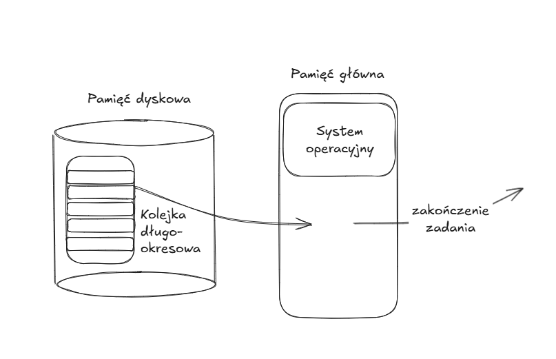

W przypadku wymiany, w pamięci dyskowej mamy dodatkowo kolejkę pośrednią, do której mogą trafiać
procesy oczekujące na realizacją operacji I/O.

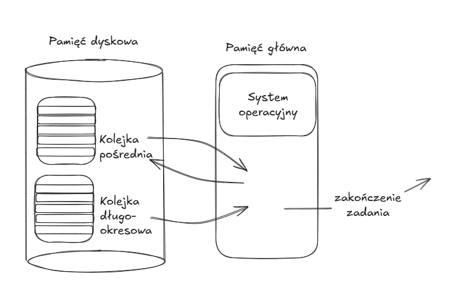

Bardziej wyrafinowany schemat wymiany procesów umożliwiający jeszcze lepsze wykorzystanie procsora i
pamięci jest oparty o pojęcie *pamięci wirtualnej*.

### Partycjonowanie

System operacyjny zajmuje pewną ustloną część pamięci głównej. Reszta pamięci musi być jakoś
podzielona (partycjonowana), aby mogło z niej korzystać wiele procesów.

Najprosztszym schematem jest wprowadzenie *podziałów o stałych (ale niekoniecznie równyuch)
rozmiarach*. Proces jest umieszczany w najmniejszej dostępnej partycji, która może go pomieścić. To
podejście jednak w oczywisty sposób marnuje cenną pamięć główną.

Trochę lepszym rozwiązaniem jest użycie *partycji o zmiennych rozmiarach*. Gdy proces jest
wprowadzany do pamięci, jest umieszczany w obszarze o dokładnie takiej pojemności jaka jest
niezbędna. Metoda ta może jednak doprowadzić do powstania wielu małych luk w pamięci, do których nie
możemy zmieścić żadnego procesu i tym samym nadal marnujemy pamięć.

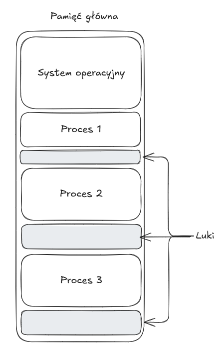

### Upakowanie (compaction)

Możliwym rozwiązaniem problemu luk jest upakowanie - system operacyjny od czasu do czasu *przesuwa
procesy w pamięci* w celu pozbycia się luk i skumulowania wolnej pamięci w spójnym bloku. Jest to
jednak procedura czasochłonna angażująca procesor.

Zauważmy tutaj inny kluczowy problem związany z przesuwaniem pamięci procesów wewnątrz pamięci
głównej. Program każdego procesu zawiera dane i instrukcje, w tym instrukcje, które zmieniają
zawartość rejestru PC lub przemieszczają dane między danymi adresami. Jeśli zmienimy położenia
zawartości pamięci to *bezwzględne adresy* (*adresy fizyczne*) zostaną zmienione i rozkazy będą
operować na błędnych adresach. Dlatego też wprowadza się rozróżnienie na *adresy logiczne/wirtualne*
(czyli położenie komórki pamięci względem *początku programu*) i *adresy fizyczne* (czyli aktualne
bezwzględne położenie w pamięci głównej). Gdy procesor realizuje proces dokonuje automatycznej
konwersji adresów logicznych na fizyczne poprzez dodanie do adresu logicznego, aktualnego położenia
początku procesu (tzw. *adresu bazowego*). Warto zaznaczyć, że jest to realizowane sprzętowo.

### Stronicowanie

O ile dynamiczne partycjonowanie z upakowaniem i konwersją adresów jest pewnym rozwiązaniem
problemów mechanizmu wymiany to nadal posiada wady (angażowanie procesora). Znacznie lepszym i
standardowo stosowanym rozwiązaniem jest stronicowanie.

Pamięć główna jest podzielona na wiele niewielkich fragmentów o ustalonym, jednakowym rozmiarze np.
1KB - są to tzw. *ramki stron*. Każdy program jest z kolei podzielony na jednakowe fragmenty zwane
*stronami* o rozmiarach ramek. Gdy proces jest wprowadzany do pamięci głównej, jego strony są
ładowane do dostępnych ramek stron w pamięci. Ramki te *nie muszą* ze sobą sąsiadować, aby zmieścić
proces w pamięci. Osiągamy dzięki temy znacznie lepsze wykorzystanie pamięci głównej.

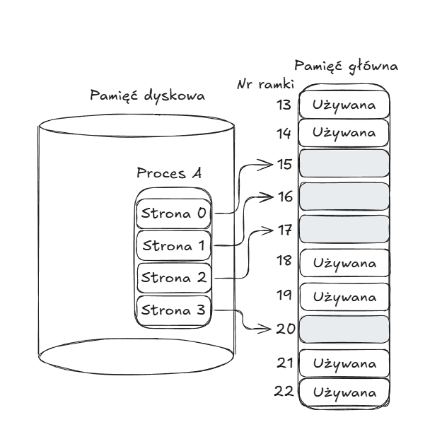

Zauważmy tutaj, że występuje ten sam problem związany z konwersją adresu logicznego na fizyczny.
Teraz jednak prosty adres bazowy nie wystarczy. Zamiast tego system operacyjny tworzy *tablicę
stron* (page table) dla każdego procesu. Adsres logiczny komórki w obrębie programu składa się z
adresu stronu i offsetu w obrębie tej strony. Tablica stron dokonuje konwersji numeru strony na
adres fizyczny początku odpowiadającej jej ramki strony i przez dodanie offsetu otrzymywany jest
adres fizyczny danej komórki pamięci. Nadal translacja wykonywana jest sprzętowo.

### Pamięć wirtualna

Ulepszeniem mechanizmu stronicownia jest tzw. *stronicowanie na żądanie*, które oznacza po prostu,
że każda strona procesu jest wprowadzana z pamięci dyskowej do pamięci głównej tylko wtedy, gdy jest
potrzebna (tj. następuje odwołanie do komórki pamięci znajdującej się na tej stronie). Jeśli program
odniesie się do danych znajdujących się na stronie poza pamięcią główną, zostanie zasygnalizowany
*błąd strony* (przerwanie). System operacyjny dostarczy wówczas wymaganej strony z dysku.

W określonym momencie tylko kilka stron danego procesu znajduje się w pamięci głównej i dzięki temu
więcej procesów może pozostawać w pamięci. Idea ta ma doniosłe konsekwencje: *istnieje możliwość,
żeby proces był większy od całej pamięci głównej*. Ponieważ proces jest realizowany tylko w pamięci
głównej, pamięć ta jest określana jako *pamięć rzeczywista*. Jednak programista dysponuje o wiele
większą pamięcią - tą, która znajduje się na dysku. Ta ostatnia jest wobec tego nazywana *pamięcią
wirtualną*.

#### TLB (Translation Lookaside Buffer)

W zasadzie każde odniesienie do pamięci wirtualnej wywołuje dwa dostępy do pamięci fizycznej - jeden
w celu pobrania odpowiedniego zapisu tablicy stron, a drugi w celu pobrania żądanych danych. Podwaja
to czas dostępu do pamięci. Rozwiązaniem jest użycie specjalnej pamięci podręcznej zapisów tablicy
stron, która jest nazywana *buforem translacji adresów tablicy stron*. Pamięć ta zawiera te zapisy
tablic stron, które były ostatnio używane.

### Segmentacja

Segmentacja pozwola programiście widzieć pamięć jako składającą się z wielu przestrzeni adresowych
(czyli segmentów). Segmenty mają zmienny, dynamiczny rozmiar. Każdy segment może mieć przypisane
prawa dostępu. Odniesienia do pamięci obejmują adres w postaci numeru segmentu i adresu względenego
(offsetu).


# Jednostka centralna

## Lista rozkazów

Lista rozkazów maszynowych określa *wymagania funkcjonalne procesora*. Implementacja procesora w
znacznej mierze polega na wdrożeniu listy rozkazów.

Wewnątrz komputera każdy rozkaz jest reprezentowany za pomocą ciągu bitów, który jest podzielony na
pola odpowieadające elementom składowym rozkazu np.

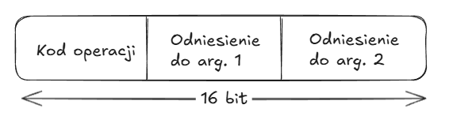

Powszechną praktywką jest używanie symbolicznej reprezentacji rozkazów, w której kody operacji są
zapisywane w postaci skrótów (tzw. *mnemoniki*). 

Program symboliczny
```txt
101    LDA    201
102    ADD    202 
103    ADD    203 
104    STA    204 

201    DAT    2 
202    DAT    3 
203    DAT    4 
204    DAT    0 
```

Program asemblerowy
```asm
FORMUL    LDA    I
          ADD    J
          ADD    K
          STA    N

I         DAT    2
J         DAT    3 
K         DAT    4
N         DAT    0
```


Możemy podzielić rozkazy występujące w typowej liście rozkazów na trzy rodzaje:
* przetwarzanie danych - rozkazy arytmetyczne i logiczne
* przenoszenie danych - rozkazy pamięci i modułu I/O
* sterowanie - rozkazy sterujące, skoki i rozgałęzienia


## Podprogramy

Gdy procesor realizuje wywołanie podprogramu, przekazuje nas stros adres powrotu i parametry, które
mają być przekazane do podprogramu. Zestaw ten jest określany jako *ramka stosu*.

## Implementacja stosu

Stos jest na tyle użyteczną strukturą, że stanowi część implementacji procesora.

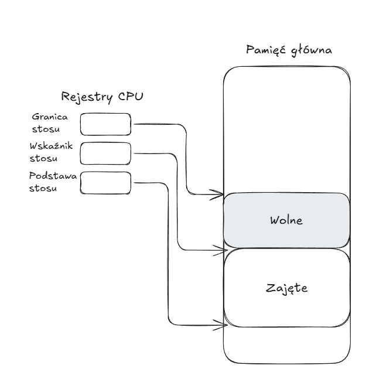

## Przetwarzanie potokowe

Przetwarzanie potokowe rozkazów jest podobne do użycia linii montażowej w zakładzie produkcyjnym.
Dzięki zorganizowaniu procesu produkcyjnego w formie linii montażowej, możliwa jest jednoczesna
praca nad wyrobami w różnych stadiach produkcji. Jednym z głównych problemów przy projektowaniu
potoków rozkazów jest rozkaz rozgałęzienia warunkowego. Aż do zakończenia wykonywania tego rozkazu
nie jest możliwe stwierdzenie, czy rozgałęznienie nastąpi, czy nie. Możliwym sposobem postępowania
jest tzw. *przewidywanie rozgałęzienie* (branch prediction). Istnieje wiele metod przewidywania,
jednak najważniejsza z nich to oparta na *tablicy historii rozgałęzień*. Jest to mała pamięć
podręczna powiązana z etapem pobierania rozkazu w potoku. Każdy zapi tablicy składa się z trzech
elementów:
* adresu rozkazu rozgałęzienia
* pewnej liczby bitów historii
* informacji o rozkazie docelowym

## Optymalizacja rejestrów za pomocą kompilatora

Każda wielkość programu mająca pozostawać w rejestrach jest przypisywana do *rejestru
symbolicznego*. Następnie kompilator odwzorowuje nieograniczoną liczbę rejestrów symbolicznych na
ustaloną liczbę rejestrów rzeczywistych. Jeśli w określonej części programu występuje więcej
wielkości niż rejestrów rzeczywistych to niektóre z nich muszą być przypisane do lokacji w pamięci.

Istotą zadania optymalizacji jest zdecydowanie, które wielkości mają być przypisane rejestrom w
określonym punkcie programu. Problem ten możne wyrazić jako problem kolorowania grafu (graph
coloring). Węzłami grafu są rejestry symboliczne. Jeśli dwa rejestry symboliczne są aktywne w tym
samym fragmencie programu, to łączy się je krawędzią. Następnie próbuje się rozwiązać problem
kolorowania grafu na tak utworzonym grafie przy użyciu co najmwyżej tylu kolorów, co liczba
rzeczywistych rejestrów.

## Superskalarność

Rozwiązanie superskalarne polega na możliwości równoległego wykonywania wielu rozkazów. Termin
*paraleleizm na poziome rozkazu* odnosi się do stopnia, w którym rozkazy programu mogą przeciętnie
być wykonywane równolegle.